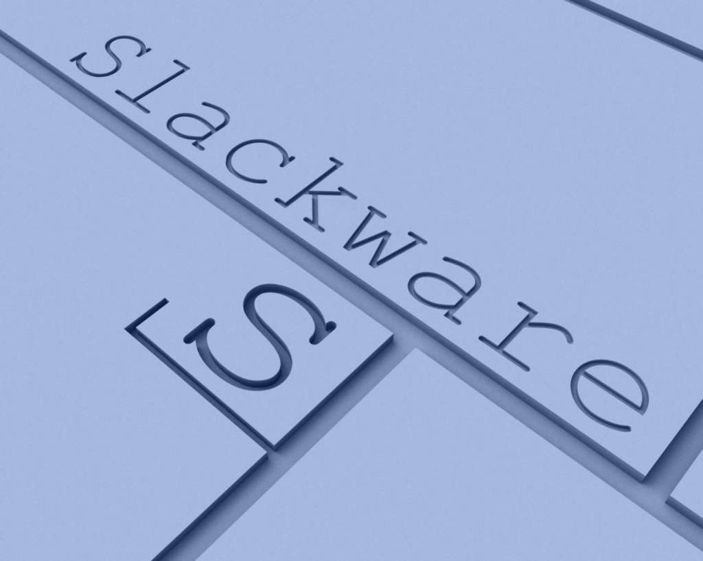

# my-slackbuilds

Personal collection of SlackBuild scripts by danix, following
[SlackBuilds.org (SBo)](https://slackbuilds.org) conventions.

Primarily targeting **Slackware64-current**.

This repository serves two purposes:

- **New packages** — SlackBuilds for programs not yet available on SBo
- **Updated packages** — SlackBuilds for programs already on SBo but whose official build lags behind the latest upstream release

---

## Repository Structure

Each package lives in its own top-level subfolder:

```
<package-name>/
├── <package-name>.SlackBuild   # Main build script
├── <package-name>.info         # Metadata (version, checksums, URLs)
├── README                      # Description and usage notes
├── slack-desc                  # Package description (11-line format)
└── <package-name>.desktop      # (optional) Desktop entry for GUI apps
```

---

## Packages

| Package | -current | 15.0 | SBo | Version | Latest |
|---------|----------|------|-----|---------|--------|
| hstr | ✅ | not tested | ✅ [hstr](https://slackbuilds.org/repository/15.0/system/hstr/) | 3.2 | 3.2 |
| discord | ✅ | not tested | ✅ [discord](https://slackbuilds.org/repository/15.0/network/discord/) | 1.0.151 | 1.0.151 |
| kitty-bin | ✅ | not tested | ❌ | 0.48.1 | 0.48.1 |
| llama.cpp-vulkan | ✅ | not tested | ❌ | b10184 | b10186 |
| qarma | ✅ | not tested | ❌ | 1.1.1 | 1.1.1 |
| opencode-bin | ✅ | not tested | ❌ | 1.18.9 | 1.18.9 |
| claude-code-bin | ✅ | not tested | ❌ | 2.1.220 | 2.1.220 |
| kvantum-qt6 | ✅ | not tested | ❌ | 1.1.8 | 1.1.8 |
| kvantum-qt5 | ✅ | not tested | ✅ [kvantum-qt5](https://slackbuilds.org/repository/15.0/system/kvantum-qt5/) | 1.1.8 | 1.1.8 |
| gitleaks | ✅ | not tested | ❌ | 8.30.1 | 8.30.1 |
| mutagen | ✅ | not tested | ✅ [mutagen](https://slackbuilds.org/repository/15.0/development/mutagen/) | 1.48.1 | 1.48.1 |
| solvespace | ✅ | not tested | ❌ | 3.2 | 3.2 |
| gamescope | ✅ | not tested | ✅ [gamescope](https://slackbuilds.org/repository/15.0/system/gamescope/) | 3.16.25 | 3.16.25 |
| nvchecker | ✅ | not tested | ❌ | 2.21 | 2.21 |
| python3-structlog | ✅ | not tested | ❌ | 26.1.0 | 26.1.0 |
| python3-platformdirs | ✅ | not tested | ✅ [python3-platformdirs](https://slackbuilds.org/repository/15.0/python/python3-platformdirs/) | 4.11.0 | 4.11.0 |
| python3-awesomeversion | ✅ | not tested | ❌ | 25.8.0 | 25.8.0 |
| python3-fsspec | ✅ | not tested | ❌ | 2026.7.0 | 2026.7.0 |
| python3-packaging | ✅ | not tested | ❌ | 26.2 | 26.2 |
| python3-annotated-doc | ✅ | not tested | ❌ | 0.0.5 | 0.0.5 |
| python3-typer | ✅ | not tested | ❌ | 0.27.0 | 0.27.0 |
| python3-huggingface_hub | ✅ | not tested | ❌ | 1.25.1 | 1.25.1 |
| python3-telethon | ✅ | ✅ | ❌ | 1.44.0 | 1.44.0 |
| click | ✅ | not tested | ✅ [click](https://slackbuilds.org/repository/15.0/python/click/) | 8.4.2 | 8.4.2 |
| playwright-cli | ✅ | not tested | ❌ | 0.1.17 | 0.1.17 |
| firefly-cli | ✅ | not tested | ❌ | 0.5.0 | 0.5.0 |
| gitea-cli | ✅ | ✅ | ❌ | 0.15.0 | 0.15.0 |
| megasync-bin | ✅ | ✅ | ❌ | 6.5.0.2 | 6.5.0.2 |
| claude-desktop-bin | ✅ | ✅ | ❌ | 1.24012.9 | 1.24012.9 |
| hyprsunset-qt | ✅ | not tested | ❌ | 0.1.1 | 0.1.1 |
| python3-pathvalidate | ✅ | not tested | ❌ | 3.3.1 | 3.3.1 |
| python3-onnxruntime | ✅ | not tested | ❌ | 1.28.0 | 1.28.0 |
| piper-tts | ✅ | not tested | ❌ | 1.6.1 | 1.6.1 |

> **Note on `kvantum-qt5`:** the official SBo build lags several releases behind
> upstream (1.1.2 vs 1.1.8), so this repo ships an updated build. It provides the
> Qt5 style plugin only (`libkvantum.so`); the kvantummanager GUI and bundled
> themes come from the `kvantum-qt6` package, which upstream now builds Qt6-only.

---

## Usage

### Prerequisites

- Slackware64-current
- Root access (required to run `.SlackBuild` scripts)
- [`sbo-maintainer-tools`](https://slackware.uk/~urchlay/repos/sbo-maintainer-tools) (optional, for linting and source downloads)

### Building a package

```bash
# Clone the repository
git clone https://github.com/danix/my-slackbuilds.git
cd my-slackbuilds

# Fix any .info issues automatically
cd <package-name> && sbofixinfo

# Download the source and verify checksums
cd <package-name> && sbodl

# Lint the script and metadata
cd <package-name> && sbolint

# Build the package
cd <package-name> && sudo bash <package-name>.SlackBuild

# Install the resulting package
installpkg /tmp/<package-name>-*.t?z
```

Check each package's `README` for dependencies and any special build instructions.

---

## Git Hooks

Two hooks are included in `hooks/`. Install them after cloning:

```bash
cp hooks/pre-commit .git/hooks/pre-commit
cp hooks/post-commit .git/hooks/post-commit
chmod +x .git/hooks/pre-commit .git/hooks/post-commit
```

| Hook | Purpose |
|------|---------|
| `pre-commit` | Runs [`sbolint`](https://slackware.uk/~urchlay/repos/sbo-maintainer-tools) on staged packages before each commit. Also guards against staged source archives: symlinks are auto-removed silently, real archive files block the commit and list the offenders. |
| `post-commit` | After each commit, offers to create a `SBo/<pkg>.tar.gz` archive ready for submission to SlackBuilds.org |

---

## License

GPL-2.0 — see [LICENSE](LICENSE).

## Development Approach

This project is developed using AI-assisted tools. Code is generated with the help of AI based on human-provided specifications, design decisions, and iterative feedback.

All contributions are reviewed, tested, and curated by the maintainer before being included in the codebase. AI is used as a productivity and exploration tool, while human oversight remains central to all decisions.

The goal is to combine the flexibility of AI-assisted development with standard open-source practices such as transparency, review, and accountability.
